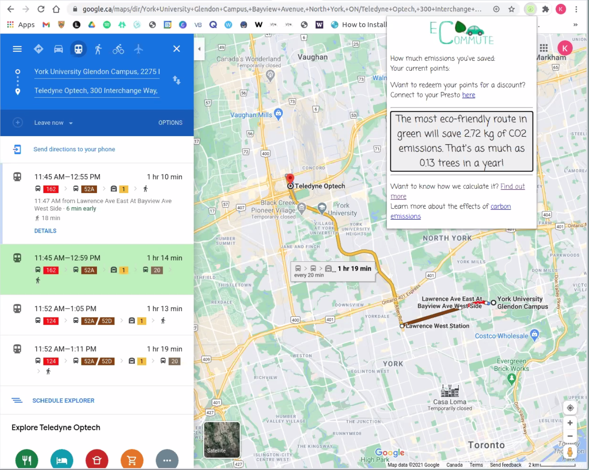

# Eco-commute-demo
JavaScript Chrome Extension determines most sustainable public transit route to get from A to B and the amountof CO2 emissions saved by taking public transit instead of driving. 

IDEA PITCH
Tool to help commuters determine the route to work with the lowest carbon footprint

IDEA DESCRIPTION
Currently, travel apps such as Waze and Google maps generate the fastest way to get from A to B. Eco-commute seeks to answer the question: what is the most sustainable way to get from A to B? Integrated with the map apps we all know and love, Eco-commute uses its custom web service to calculate carbon emissions for every possible transit route and driving. Our extension informs the user of the route with the lowest carbon emissions and how much they save on carbon emissions compared to driving. Carbon savings are stored in our scalable cloud storage so that users can connect their g-mail account to public services such as Presto, TTC, etc. to get transit rewards. 

WHAT MOTIVATED YOU TO GO WITH THIS PROJECT?
Public transit is a great way to travel around the city. It's affordable and accessible. However, sometimes consumers forget to reliaize how something as simple as taking transit makes a significant impact on emissions. We wanted to educate consumers on this. 

HOW IMPACTFUL IS YOUR INNOVATION?
Our extension quatitiefies carbon savings in kg and the equivalent carbon dioxide absorption from trees in year. This makes carbon emission data easy to understand and shows user the impact of their daily decision. 

North America is home to the world's dirtiest cars in terms of carbon emissions. Climate change is a major problem in our present and future world. If Canada is ever to reach its Paris Agreement commitments, we need to motivate consumers to make eco-conscious decisions about transit. Eco-commute does this. 

WHAT IS YOUR ENVISIONED SOLUTION?
A custom web service that computes the carbon emission data is hosted on Firebase. The wen service uses the google maps API and directions API in addition to publicaly accessible research on carbon emissions. This artchitecture makes it easy for our solution to integrate into any app and website. For Elle Hacks, we've focused our efforts on a chrome extension, a lightweight and accessible version of the tool. 

DO YOU HAVE ANY DESIGNS?
The primary goal is a chrome extension with a simplistic front-end connected to a custom API so that the tool can be migrated to apps and other websites. 

WHAT IS THE POTENTIAL FOR IMPACT OF THE IDEA?
One of the most pressing issues of public transit today is maintaining service in a time of low ridership. Our tool can hopefully convert drivers to public transit by incentivizing the decision through transit discounts and environmental education. 

<b>Tools:</b> Google Cloud Platform, JavaScript, API, Firebase, FireStore, Chrome Dev Tools
